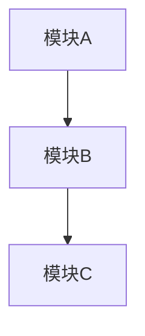

# 模块分解

## 输入依赖

- **必须**：FC 功能清单
- **必须**：边界定义文档（--boundary）

## 模块类型参考

| 模块类型 | 职责 | 典型示例 |
|---------|------|----------|
| **感知模块** | 环境感知、目标识别 | 摄像头感知SWC、雷达融合SWC |
| **规划控制模块** | 路径规划、轨迹控制 | 行为规划SWC、轨迹跟踪SWC |
| **MFF状态机模块** | 系统模式管理 | MFF状态机-SWC、MFF云端配置管理-SWC |
| **诊断/故障管理模块** | DTC 管理、降级决策 | 故障诊断-DM |
| **安全相关模块** | 功能安全、执行器监控 | 功能安全-Safe、VMS仲裁 |
| **通信管理模块** | 总线收发、SOA代理 | CAN适配SWC、SOA代理SWC |

## 分解原则

- 单一职责：每个模块只做一件事
- 接口可测试：模块间通过明确接口通信
- 内聚高、耦合低

## 输出格式

### FC→模块映射表

| FC-ID | 功能名 | 分解子功能 | 归属模块 |
|-------|--------|------------|----------|

### 软件模块清单

| 模块名 | 职责描述 | 包含子功能 |
|--------|----------|------------|

### 模块架构图



## 执行示例

```bash
/module-decomp ./FC清单.md --boundary=./边界定义.md
```
